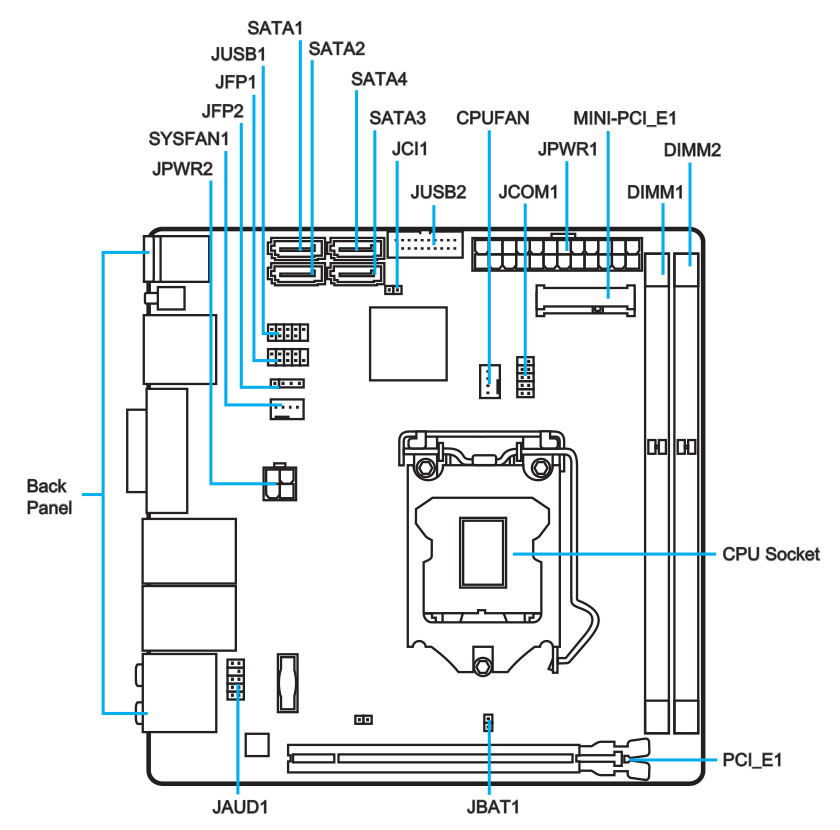
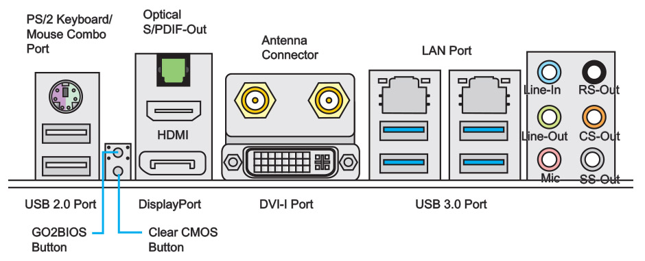

# MSI Z97i-AC

This repository contains personal work and files, developed and maintained for a successful use with [Clover EFI bootloader](https://github.com/CloverHackyColor/CloverBootloader/) on this specific Intel NUC model. There are **no** ready, pre-packaged EFI solutions provided; instead, the needed configuration and ACPI files are published for those interested in studying the code, while creating their own bootloader configurations.

## Platform Generation

* Sandy Bridge = All Core ix-3xxx (HD Graphics 3000)
* Ivy Bridge = All Core ix-3xxx (HD Graphics 4000)
* **Haswell = All Core ix-4xxx (HD Graphics 4600)**
* Broadwell = All Core ix-5xxx (Iris Pro Graphics 6200)
* Skylake = All Core ix-6xxx (HD Graphics 5xx)
* Kaby Lake = All Core ix-7xxx (UHD/Iris Plus Graphics 6xx)
* Coffee Lake = All Core ix-8xxx (UHD/Iris Plus Graphics 6xx)

## Product Description

**Specifications:** 
https://www.msi.com/Motherboard/Z97I-AC/Specification

**Downloads:** 
https://www.msi.com/Motherboard/support/Z97I-AC#down-bios

**Main Characteristics:**

* **Form Factor:** Mini-ITX
* **Chipset:** Intel Z97 Express
* **RAM:** 2 x DDR3 @ 1600MHz (Dual Channel)
* **Slots:** 1 x PCI-Express Generation 3 (x16)
* **Display:** 1 x DisplayPort; 1 x HDMI; 1 x DVI
* **LAN:** 2 x Realtek 8111E (Gigabit)
* **Audio:** Realtek ALC892
* **WLAN/BTLE:** Intel Dual Band Wireless-AC 7260 (mini-PCIe)

## Generation Details: Haswell Refresh (Devil's Canyon) (2014)

**CPU:** Intel Core i7-4790K @ 4.00 GHz up to 4.40 GHz / 4 Cores / 8 Threads (LGA 1150)

**GPU:** Intel HD Graphics 4600 / 350 MHz up to 1.25 GHz

**URL:** https://ark.intel.com/content/www/us/en/ark/products/80807/intel-core-i7-4790k-processor-8m-cache-up-to-4-40-ghz.html

## Geekbench

**V4 Scores:** https://browser.geekbench.com/v4/cpu/search?q=Core+i7-4790K

**V5 Scores:** https://browser.geekbench.com/v5/cpu/search?q=Core+i7-4790K

## Product Overview

## Compatible Models

Mac Model: iMac15,1 
CPU: Core i7-4790K @ 4.00 GHz up to 4.40 GHz / 4 Cores / 8 Threads 
GPU: AMD Radeon R9 M290X 
Everymac: https://everymac.com/ultimate-mac-lookup/?search_keywords=iMac15,1 
Board ID: 42FD25EABCABB274 
BIOS Revision: IM151.88Z.F000.B00.1812191437 
BIOS Revision: IM151.88Z.F000.B00.1907241312 
BIOS Revision: IM151.88Z.F000.B00.2002052035 
BIOS Revision: IM151.88Z.F000.B00.2012171740 

## Current Setup

**Memory:** 16GB in 2 x 8GB PC3-12800 DIMM (1.5V) 
**RAM:** Corsair "Vengeance" DDR3LP @ 1666MHz CL9 via XMP 1.3 (Model CML16GX3M2A1600C9) 
**WLAN:** Broadcom BCM94352HMB (AzureWave AW-CE123H) [[14e4:43b1]](http://pci-ids.ucw.cz/read/PC/14e4/43b1) 
**BTLE:** Broadcom BCM20702A0 (Combined Controller) [413c:8143] 
**SSD:** Samsung 860 EVO SATA III 500 MB (Model MZ-76E500B/EU) 
