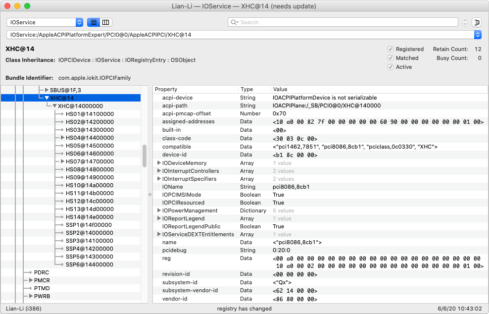

## USB Ports Patching

This is the original USB ports patching effort, leading to the creation of **USBPorts.kext** via Hackintool. 

The file `USBPorts.EHCI.Renamed.zip` contains the **USBPorts.kext** that includes the two EHCI controllers, which were renamed in Clover: 

* EHC1 → EH01
* EHC2 → EH02

They are stored here for reference only. 

Moreover, the full list of USB ports reported by the XHCI controller (using the unlimited USB ports patch) contains:

* HS01 → HS14
* SS01 → SS06

Consult **SSDT-UIAC.dsl** for more details on the MSI motherboard.

