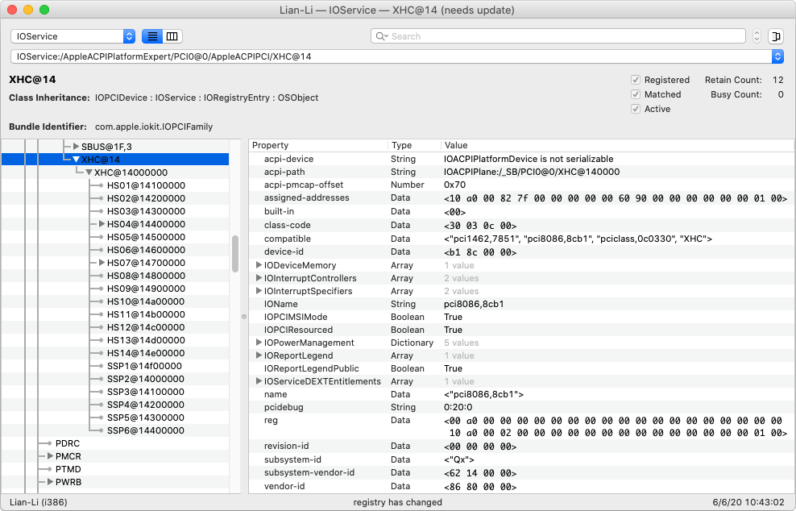

# USB Ports Patching

This is the original USB ports patching effort, leading to the creation of the final `USBPorts.kext` found in **Actively Used** folder.

The file `USBPorts.EHCI.Renamed.zip` contains the `USBPorts.kext` created by [Hackintool](https://github.com/headkaze/Hackintool/releases) that includes the single XHCI and the two EHCI controllers which were then renamed in Clover:

* EHC1 → EH01
* EHC2 → EH02

This file is stored here for reference only.

The full list of USB ports reported by the XHCI controller (using the unlimited USB ports patch, since High Sierra) contains:

* HS01 → HS14
* SS01 → SS06

Consult **SSDT-UIAC.dsl** for more details on this MSI motherboard.

